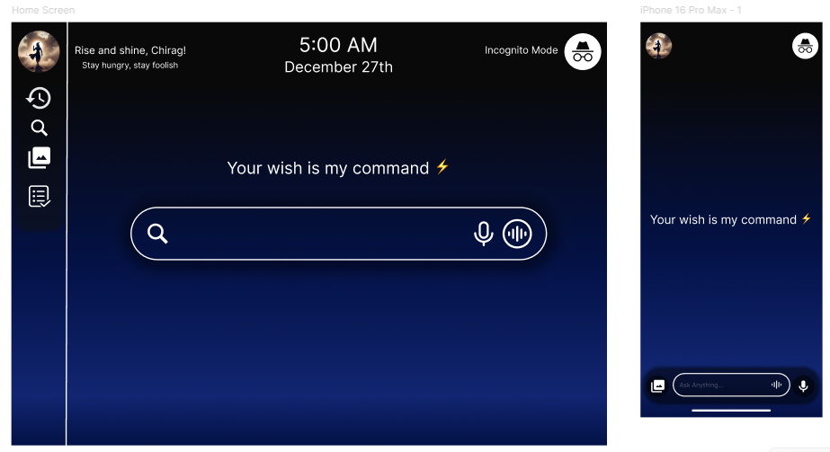

# 🤖 AI Assistant UI

A modern and minimal **AI Assistant User Interface** designed to provide users with a seamless interaction experience.  
The design focuses on **clean layout, quick access, and a futuristic feel** to simulate a personal assistant like Jarvis.

## ✨ Features
- Dashboard with quick actions (search, reminders, notes)  
- Voice interaction button with glowing animation  
- Chat interface for conversations  
- Dark and light theme variants  
- User profile and settings screen  

## 🛠 Tools Used
- Figma

## 🎨 Preview

## 🔗 Live Prototype
[View on Figma](https://www.figma.com/...)
