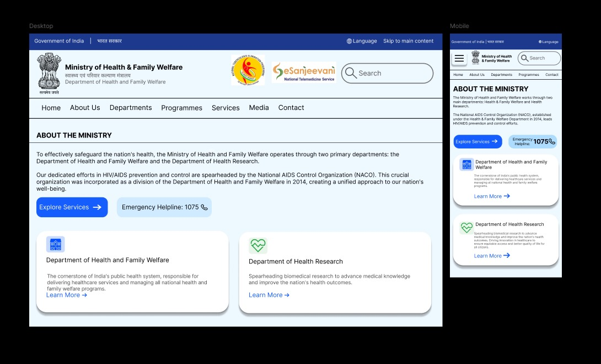

# Redesigned Landing Page

A mordern, responsive, and visually appelaing landing page redesign to improve first impressions and user engagement.For both 'Desktop' and 'Mobile'.

## 🚀 Features
- Clean and Minimal UI
- Responsive design (mobile-friendly)
- Smooth layout and typography
- Clear Call-to-Action Buttons

---

## 🛠️ Tools Used
- Figma 

---

## 📸 Preview

  

---