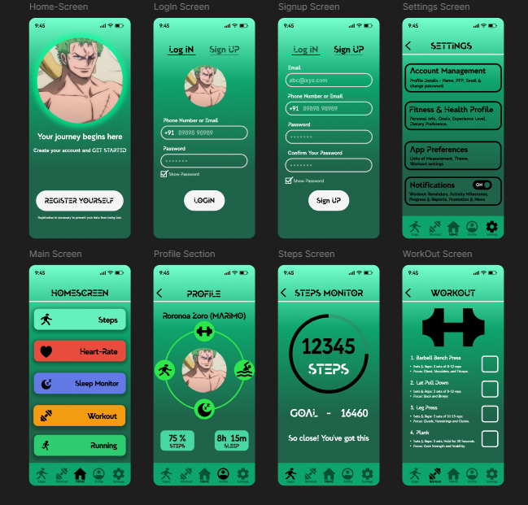
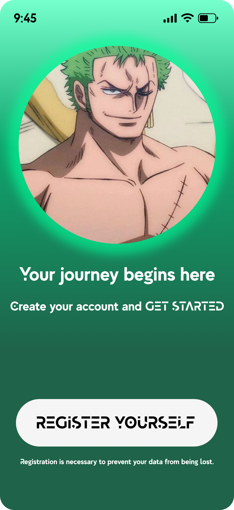
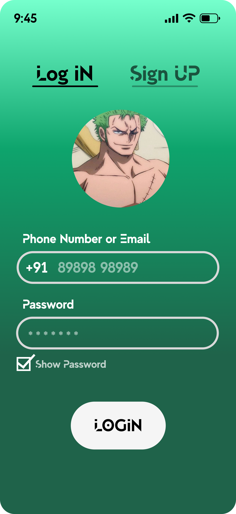
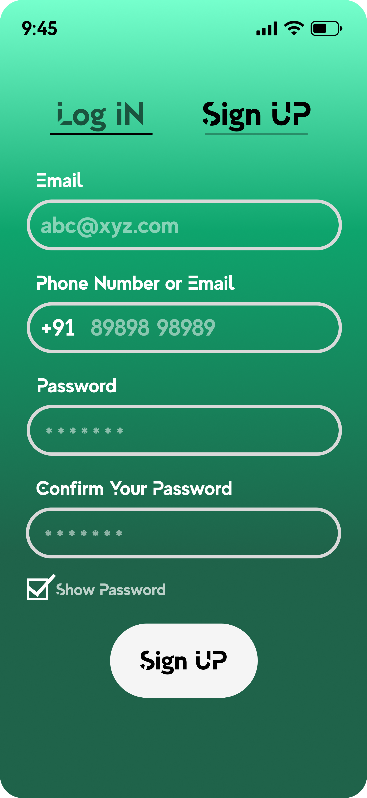
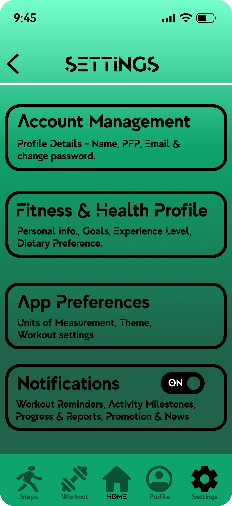
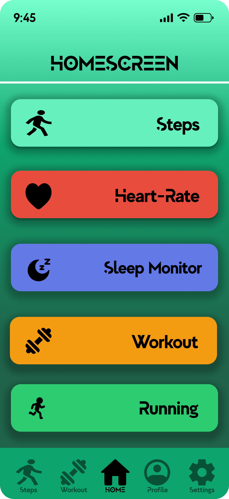
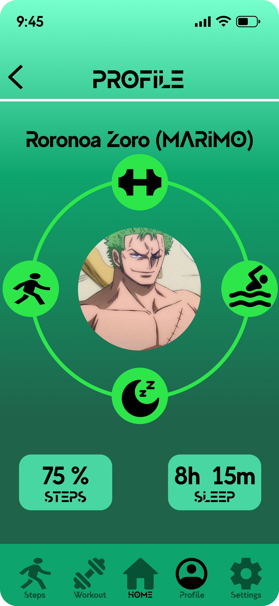
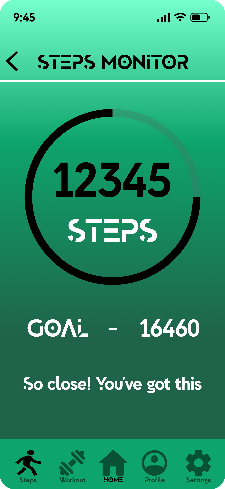
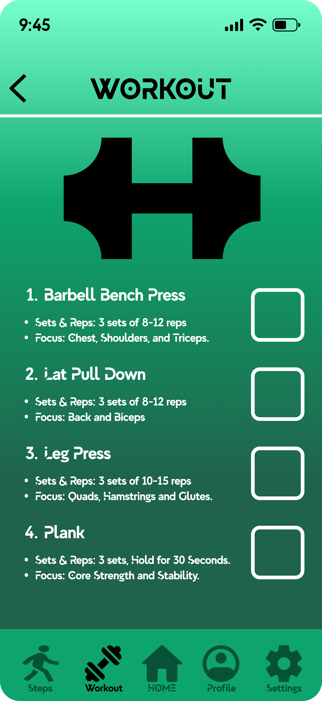

# 💪 Fitness App UI — Designed in Figma

A **Modern Fitness App UI** concept designed in **Figma**, combining health tracking with a clean, motivating interface.  
This project was designed in just **2 days** to showcase my UI/UX design skills and creative speed.

---

## 🧭 Overview

The app focuses on helping users track their fitness journey — from workouts and steps to heart rate and sleep.  
It also features **anime-inspired visuals** for motivation and personalization.

---

## 💡 Key Features

- 🏠 Clean and minimal home layout  
- 🔐 Simple login & signup flow  
- 🏃 Steps and heart rate tracking UI    
- 😴 Sleep monitor and workout planner  
- ⚙️ Settings & customization options  
- 🎨 Anime-inspired theme for motivation

 

---

## 🎨 Preview

    

 

    

   

---

## 🧰 Tools Used

- **Figma** – Design & Prototyping  
- **Google Fonts** – Typography  
- **Flaticon / Freepik** – Icons & assets  
- **Color Palette:** Shades of teal & emerald

---

## 🔗 Live Preview

[See it in Action on Figma](https://www.figma.com/design/bd97OAE9eXC6qqAv4PVRaM/Fitness-App?node-id=0-1&t=QaRU0ervSgQ0ghkH-1)

---

## 🧠 About This Project

This app was designed as part of my **UI/UX design portfolio**.  
The goal was to blend **fitness motivation** with a **clean, gamified interface** — showing how design can encourage users to stay active.

---

## 👨‍🎨 Designer

  **Chirag Kumar Soni**   

📍UI/UX & Graphic Designer  

[***My LinkedIn***](https://www.linkedin.com/in/chirag-kumar-soni) • [***My Portfolio***](https://github.com/chirag-kumar-soni)

---

### ⭐ If you like this design, consider giving the repo a star!
